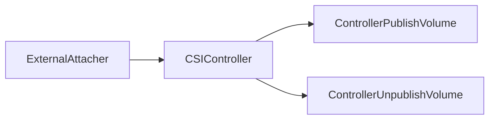
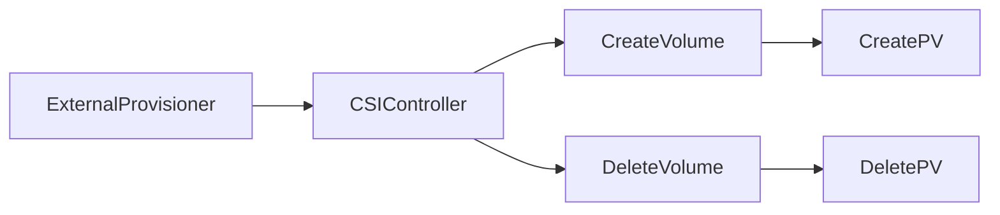
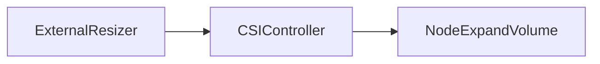
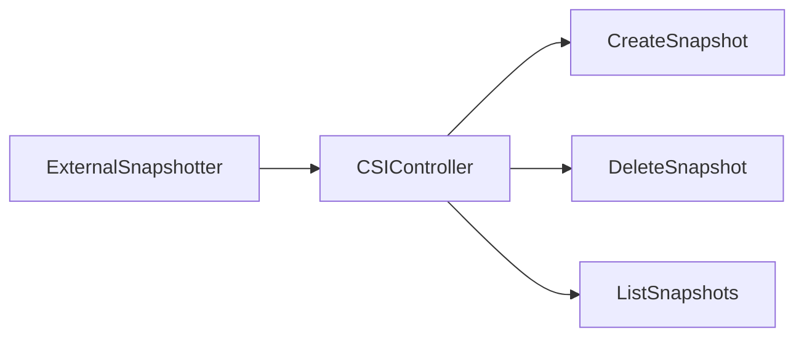
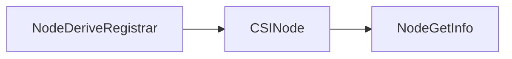

# 资料
[CSI Design](https://github.com/kubernetes/design-proposals-archive/blob/main/storage/container-storage-interface.md)  
[CSI Docs](https://kubernetes-csi.github.io/docs/)

---
# 术语

- CSI
> (Container Storage Interface), 旨在能为容器编排引擎和存储系统间建立一套标准的存储调用接口，通过该接口能为容器编排引擎提供存储服务。

- in-tree
> 存在于 Kubernetes 核心资源库中的代码。

- out-of-tree	
> 存在于 Kubernetes 核心资源库之外某处的代码。

- CSI Volume Plugin	
> A new, in-tree volume plugin that acts as an adapter and enables out-of-tree, third-party CSI volume drivers to be used in Kubernetes.

- CSI Volume Driver	
> An out-of-tree CSI compatible implementation of a volume plugin that can be used in Kubernetes through the Kubernetes CSI Volume Plugin.

- SP
> Storage Provider, 第三方存储提供方， 也就是实施 CSI Drvier 的一方。

---
# 背景、动机
Kubernetes volume plugin 目前是 "in-tree" 的状态，意味着它们与核心的 kubernetes 二进制文件一起被链接、编译、构建和发行。向 Kubernetes 添加一个新的存储系统（a volume plugin）需要将代码添加到 Kubernetes 核心代码库中。但是这是不不可取的，原因有很多，比如：

  1. Volume plugin 的发展、发布和 kubernetes 紧耦合且依赖于 kubernetes 的版本
  2. Kubernetes 开发、社区负责人员需要测试和维护所有的 volume plugin，而不仅仅是测试和维护稳定的插件
  3. Volume plugin 的 bug 可能导致整个 kubernetes crash
  4. Volume plugin 和 kubernetes 拥有同样的特权
  5. 必须提供 Volume plugin 的源码，而不能选择只提供一个二进制文件

---
# 概述
为了支持 CSI 兼容的 Volume plugins, Kubernetes 在其核心代码库中实现了 CSI Volume Plugin，CSI Volume Plugin 将成为 Kubernetes 用户（应用程序开发人员和集群管理员）与外部 CSI Volume Drive(第三方存储提供者) 交互的机制

---
# 设计架构
> CSI 采用的 grpc 调用，grpc 调用的一个优势就是可以将 grpc 服务运行在 socket 上，这样服务端就可以运行在 socket 端点的任何地方，换句话说就是可以被隔离单独运行，这样就可以实现扩展，然后通过标准 rpc 接口，完成本地原生模式的控制。CSI 提供了一套标准的接口集成在 k8s 的源码（kube-controller-manager，kubelet）中，第三方存储插件只需要实现这些接口并注册就可以调用对应的函数进行 pv 和 pvc 的自动创建，提供了可扩展的机会。

---
# 部署架构

## StatefulSet/Deployment
> 可以理解为 CSI DRIVER 中的 CONTROLLER 对存储资源和存储卷进行管理和操作。
- 用户实现的 CSI 插件，也就是 CSI Driver 存储驱动容器
- SideCar 容器
  1. [External Attacher](https://github.com/kubernetes-csi/external-attacher): 监听 VolumeAttachment 对象，调用 ControllerPublish/ControllerUnpublish 来 attach/detach.(ControllerPublish -> attach volume 到一个节点，ControllerUnpublish -> 将节点的 volume detach)
  2. [External Provisioner](https://github.com/kubernetes-csi/external-provisioner): 监听 PersistentVolumeClaim 对象, 调用 CreateVolume/DeleteVolume 来创建/删除 volume.

## DaemonSet
> 对 Node 上 Volume 管理和操作。比如挂载/卸载 volume.
- 用户实现的 CSI 插件，也就是 CSI Driver 存储驱动容器，主要功能是接收 kubelet 的调用，需要实现一系列与 Node 相关的CSI 接口，例如 NodePublishVolume/NodeUnpublishVolume.
- SideCar 容器
  1. [Driver Registrar](https://github.com/kubernetes-csi/node-driver-registrar): 注册 CSI 插件到 kubelet 中。

---
# SideCar Containers
> 由 kubernetes 存储兴趣小组开发和维护

## [External Attacher](https://github.com/kubernetes-csi/external-attacher)
> 监听 VolumeAttachment 对象，并调用 CSI driver Controller 服务的 ControllerPublishVolume 和 ControllerUnpublishVolume 接口，用来将 volume 附着到 node 上，或从 node 上删除。

## [External Provisioner](https://github.com/kubernetes-csi/external-provisioner)
> 监听 PVC 对象，并调用 CSI driver Controller 服务的 CreateVolume 和 DeleteVolume 接口，用来提供一个新的 volume。前提是 PVC 中指定的 StorageClass 的 provisioner 字段和 CSI driver Identity 服务的 GetPluginInfo 接口的返回值一样。一旦新的 volume 提供出来，K8s 就会创建对应的 PV。而如果 PVC 绑定的 PV 的回收策略是 delete，那么 external-provisioner 组件监听到 PVC 的删除后，会调用 CSI driver Controller 服务的 DeleteVolume 接口。一旦 volume 删除成功，该组件也会删除相应的 PV。

## [External Resizer](https://github.com/kubernetes-csi/external-resizer)
> 监听 PVC 对象，如果用户请求在 PVC 对象上请求更多存储，该组件会调用 CSI driver Controller 服务的 NodeExpandVolume 接口，用来对 volume 进行扩容。

## [External Snapshotter](https://github.com/kubernetes-csi/external-snapshotter)
> 该组件需要与 Snapshot Controller 配合使用。Snapshot Controller 会根据集群中创建的 Snapshot 对象创建对应的 VolumeSnapshotContent，而 external-snapshotter 负责监听 VolumeSnapshotContent 对象。当监听到 VolumeSnapshotContent 时，将其对应参数通过 CreateSnapshotRequest 传给 CSI driver Controller 服务，调用其 CreateSnapshot 接口。该组件还负责调用 DeleteSnapshot、ListSnapshots 接口。

## [Node Driver Registrar](https://github.com/kubernetes-csi/node-driver-registrar)
> 通过直接调用 CSI driver Node 服务的 NodeGetInfo 接口，将 CSI driver 的信息通过 kubelet 的插件注册机制在对应节点的 kubelet 上进行注册。

