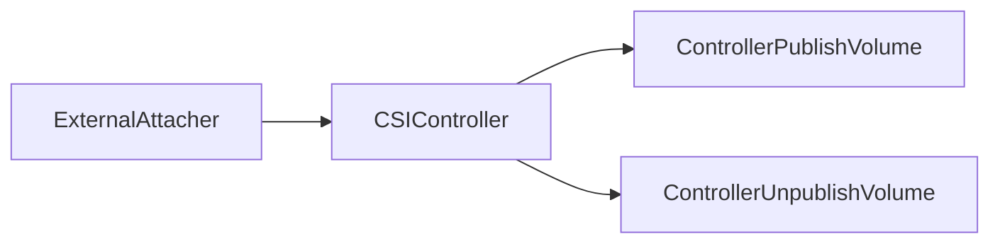
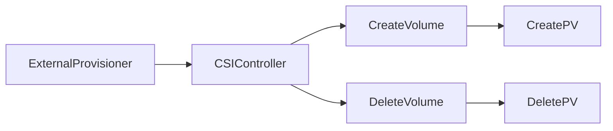
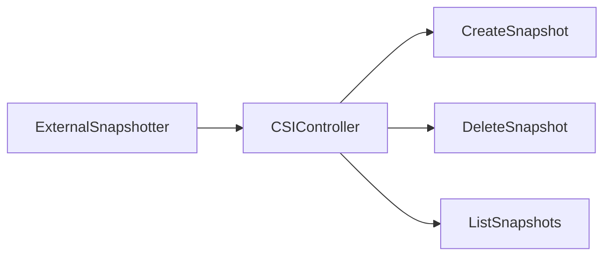
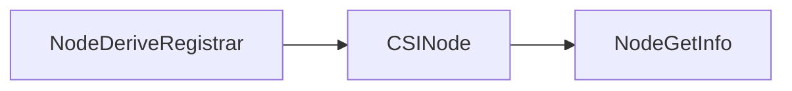
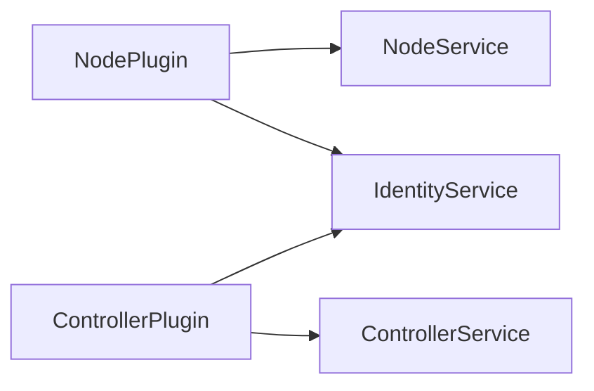

> **Have a nice day! :heart:**
---
# 术语

- CSI
> (Container Storage Interface), 旨在能为容器编排引擎和存储系统间建立一套标准的存储调用接口，通过该接口能为容器编排引擎提供存储服务。

- in-tree
> 存在于 Kubernetes 核心资源库中的代码。

- out-of-tree	
> 存在于 Kubernetes 核心资源库之外某处的代码。

- CSI Volume Plugin	
> A new, in-tree volume plugin that acts as an adapter and enables out-of-tree, third-party CSI volume drivers to be used in Kubernetes.

- CSI Volume Driver	
> An out-of-tree CSI compatible implementation of a volume plugin that can be used in Kubernetes through the Kubernetes CSI Volume Plugin.

- SP
> Storage Provider, 第三方存储提供方， 也就是实施 CSI Drvier 的一方。


---
# 背景、动机
Kubernetes volume plugin 目前是 "in-tree" 的状态，意味着它们与核心的 kubernetes 二进制文件一起被链接、编译、构建和发行。向 Kubernetes 添加一个新的存储系统（a volume plugin）需要将代码添加到 Kubernetes 核心代码库中。但是这是不不可取的，原因有很多，比如：

  1. Volume plugin 的发展、发布和 kubernetes 紧耦合且依赖于 kubernetes 的版本
  2. Kubernetes 开发、社区负责人员需要测试和维护所有的 volume plugin，而不仅仅是测试和维护稳定的
  3. Volume plugin 的 bug 可能导致 kubernetes 的其他组件 crash
  4. Volume plugin 和 kubernetes 拥有同样的特权
  5. 必须提供 Volume plugin 的源码，而不能选择只提供一个二进制文件

---
# 概述
为了支持 CSI 兼容的 Volume plugins, Kubernetes 在其核心代码库中实现了 CSI Volume Plugin，CSI Volume Plugin 将成为 Kubernetes 用户（应用程序开发人员和集群管理员）与外部 CSI Volume Drive(第三方存储提供者) 交互的机制

---
# 设计架构
> CSI 采用的 grpc 调用，grpc 调用的一个优势就是可以将 grpc 服务运行在 socket 上，这样服务端就可以运行在 socket 端点的任何地方，换句话说就是可以被隔离单独运行，这样就可以实现扩展，然后通过标准 rpc 接口，完成本地原生模式的控制。CSI 提供了一套标准的接口集成在 k8s 的源码（kube-controller-manager，kubelet）中，第三方存储插件只需要实现这些接口并注册就可以调用对应的函数进行 pv 和 pvc 的自动创建，提供了可扩展的机会。


---
# 部署架构


## StatefulSet/Deployment
> 可以理解为 CSI DRIVER 中的 CONTROLLER 对存储资源和存储卷进行管理和操作。
- 用户实现的 CSI 插件，也就是 CSI Driver 存储驱动容器
- SideCar 容器
  1. [External Attacher](https://github.com/kubernetes-csi/external-attacher): 监听 VolumeAttachment 对象，调用 ControllerPublish/ControllerUnpublish 来 attach/detach.(ControllerPublish -> attach volume 到一个节点，ControllerUnpublish -> 将节点的 volume detach)
  2. [External Provisioner](https://github.com/kubernetes-csi/external-provisioner): 监听 PersistentVolumeClaim 对象, 调用 CreateVolume/DeleteVolume 来创建/删除 volume.

## DaemonSet
> 对 Node 上 Volume 管理和操作。比如挂载/卸载 volume.
- 用户实现的 CSI 插件，也就是 CSI Driver 存储驱动容器，主要功能是接收 kubelet 的调用，需要实现一系列与 Node 相关的CSI 接口，例如 NodePublishVolume/NodeUnpublishVolume.
- SideCar 容器
  1. [Driver Registrar](https://github.com/kubernetes-csi/node-driver-registrar): 注册 CSI 插件到 kubelet 中。

---
# SideCar Containers
> 由 kubernetes 存储兴趣小组开发和维护


## [External Attacher](https://github.com/kubernetes-csi/external-attacher)
> 监听 VolumeAttachment 对象，并调用 CSI driver Controller 服务的 ControllerPublishVolume 和 ControllerUnpublishVolume 接口，用来将 volume 附着到 node 上，或从 node 上删除。



## [External Provisioner](https://github.com/kubernetes-csi/external-provisioner)
> 监听 PVC 对象，并调用 CSI driver Controller 服务的 CreateVolume 和 DeleteVolume 接口，用来提供一个新的 volume。前提是 PVC 中指定的 StorageClass 的 provisioner 字段和 CSI driver Identity 服务的 GetPluginInfo 接口的返回值一样。一旦新的 volume 提供出来，K8s 就会创建对应的 PV。而如果 PVC 绑定的 PV 的回收策略是 delete，那么 external-provisioner 组件监听到 PVC 的删除后，会调用 CSI driver Controller 服务的 DeleteVolume 接口。一旦 volume 删除成功，该组件也会删除相应的 PV。



## [External Resizer](https://github.com/kubernetes-csi/external-resizer)
> 监听 PVC 对象，如果用户请求在 PVC 对象上请求更多存储，该组件会调用 CSI driver Controller 服务的 NodeExpandVolume 接口，用来对 volume 进行扩容。


## [External Snapshotter](https://github.com/kubernetes-csi/external-snapshotter)
> 该组件需要与 Snapshot Controller 配合使用。Snapshot Controller 会根据集群中创建的 Snapshot 对象创建对应的 VolumeSnapshotContent，而 external-snapshotter 负责监听 VolumeSnapshotContent 对象。当监听到 VolumeSnapshotContent 时，将其对应参数通过 CreateSnapshotRequest 传给 CSI driver Controller 服务，调用其 CreateSnapshot 接口。该组件还负责调用 DeleteSnapshot、ListSnapshots 接口。


## [Node Driver Registrar](https://github.com/kubernetes-csi/node-driver-registrar)
> 通过直接调用 CSI driver Node 服务的 NodeGetInfo 接口，将 CSI driver 的信息通过 kubelet 的插件注册机制在对应节点的 kubelet 上进行注册。


---

# Storge Provider Plugin
> SP 需要实现 Controller 和 Node 两个插件，其中 Controller 负责 Volume 的管理，以 StatefulSet/Deployment 形式部署；Node 负责将 Volume mount 到 pod 中，以 DaemonSet 形式部署在每个 node 中。CSI 插件与 kubelet 以及 k8s 外部组件是通过 Unix Domani Socket gRPC 来进行交互调用的。CSI 定义了三套 RPC 接口，SP 需要实现这三组接口，以便与 k8s 外部组件进行通信。三组接口分别是：CSI Identity、CSI Controller 和 CSI Node.



## IdentityService
> 用于提供 CSI driver 的身份信息，Controller Plugin 和 Node Plugin 都需要实现。接口如下：
```go
service Identity {
  rpc GetPluginInfo(GetPluginInfoRequest)
    returns (GetPluginInfoResponse) {}

  rpc GetPluginCapabilities(GetPluginCapabilitiesRequest)
    returns (GetPluginCapabilitiesResponse) {}

  rpc Probe (ProbeRequest)
    returns (ProbeResponse) {}
}
```
- GetPluginInfo 是必须要实现的，Node Driver Registrar 组件会调用这个接口将 CSI driver 注册到 kubelet.
- GetPluginCapabilities 是用来表明该 CSI driver 主要提供了哪些功能。

## Controller Service
> 用于实现创建/删除 volume、attach/detach volume、volume 快照、volume 扩缩容等功能，Controller 插件需要实现这组接口。接口如下：
```go
service Controller {
  rpc CreateVolume (CreateVolumeRequest)
    returns (CreateVolumeResponse) {}

  rpc DeleteVolume (DeleteVolumeRequest)
    returns (DeleteVolumeResponse) {}

  rpc ControllerPublishVolume (ControllerPublishVolumeRequest)
    returns (ControllerPublishVolumeResponse) {}

  rpc ControllerUnpublishVolume (ControllerUnpublishVolumeRequest)
    returns (ControllerUnpublishVolumeResponse) {}

  rpc ValidateVolumeCapabilities (ValidateVolumeCapabilitiesRequest)
    returns (ValidateVolumeCapabilitiesResponse) {}

  rpc ListVolumes (ListVolumesRequest)
    returns (ListVolumesResponse) {}

  rpc GetCapacity (GetCapacityRequest)
    returns (GetCapacityResponse) {}

  rpc ControllerGetCapabilities (ControllerGetCapabilitiesRequest)
    returns (ControllerGetCapabilitiesResponse) {}

  rpc CreateSnapshot (CreateSnapshotRequest)
    returns (CreateSnapshotResponse) {}

  rpc DeleteSnapshot (DeleteSnapshotRequest)
    returns (DeleteSnapshotResponse) {}

  rpc ListSnapshots (ListSnapshotsRequest)
    returns (ListSnapshotsResponse) {}

  rpc ControllerExpandVolume (ControllerExpandVolumeRequest)
    returns (ControllerExpandVolumeResponse) {}

  rpc ControllerGetVolume (ControllerGetVolumeRequest)
    returns (ControllerGetVolumeResponse) {
        option (alpha_method) = true;
    }
}
```

## Node Service
> 用于实现 mount/umount volume、检查 volume 状态等功能，Node 插件需要实现这组接口。接口如下：
```go
service Node {
  rpc NodeStageVolume (NodeStageVolumeRequest)
    returns (NodeStageVolumeResponse) {}

  rpc NodeUnstageVolume (NodeUnstageVolumeRequest)
    returns (NodeUnstageVolumeResponse) {}

  rpc NodePublishVolume (NodePublishVolumeRequest)
    returns (NodePublishVolumeResponse) {}

  rpc NodeUnpublishVolume (NodeUnpublishVolumeRequest)
    returns (NodeUnpublishVolumeResponse) {}

  rpc NodeGetVolumeStats (NodeGetVolumeStatsRequest)
    returns (NodeGetVolumeStatsResponse) {}


  rpc NodeExpandVolume(NodeExpandVolumeRequest)
    returns (NodeExpandVolumeResponse) {}


  rpc NodeGetCapabilities (NodeGetCapabilitiesRequest)
    returns (NodeGetCapabilitiesResponse) {}

  rpc NodeGetInfo (NodeGetInfoRequest)
    returns (NodeGetInfoResponse) {}
}
```
---
# Work Flow
> pod 挂载 volume 的整个流程分为三个阶段：Provision/Delete、Attach/Detach 和 Mount/Unmount，不过不是每个存储方案都会经历这三个阶段，比如 NFS 就没有 Attach/Detach 阶段。整个过程不仅仅涉及到上面介绍的组件的工作，还涉及 ControllerManager 的 AttachDetachController 组件和 PVController 组件以及 kubelet.

## Provision
> 监听 PVC，创建存储资源。


- extenal-provisioner 和 PVController 均 watch PVC 资源, 当 PVController watch 到集群中有 PVC 创建时，会判断当前是否有 in-tree plugin 与之相符，如果没有则判断其存储类型为 out-of-tree 类型，于是给 PVC 打上 annotations: volume.beta.kubernetes.io/storage-provisioner={csi driver name}.
  ```shell
  # kubectl -n ops get pvc  data-etcd-0  -ojsonpath='{.metadata.annotations}';echo
  {"pv.kubernetes.io/bind-completed":"yes","pv.kubernetes.io/bound-by-controller":"yes","volume.beta.kubernetes.io/storage-provisioner":"rook-ceph.rbd.csi.ceph.com"}
  ```
- 当 extenal-provisioner watch 到 PVC 的 annotations 的 csi driver 与自己的 csi driver 一致时，调用 CSI Controller 的 CreateVolume 接口创建存储。
- extenal-provisioner 会在集群中创建对应的 PV。
- PVController watch 到集群中有 PV 创建时，将 PV 与 PVC 进行绑定。

## Attach
> 将存储资源 Attach 到节点上。


- ADController 监听到 pod 被调度到某节点，并且使用的是 CSI 类型的 PV，则创建一个 VolumeAttachment 资源。
- external-attacher 组件 watch 到有 VolumeAttachment 资源，调用 CSI Controller 的 ControllerPublishVolume 接口 Attach 存储到对应的节点。
- external-attacher 将对应的 VolumeAttachment 对象的 status.attached 状态设为 true.
- ADController watch 到 VolumeAttachment 对象的 status.attached 状态为 true 时，更新 ADController 内部的状态 ActualStateOfWorld.

## Mount
> 将 volume 挂载到 pod 里。


## 全景时序
>


- 调度流程
  - 创建带 pvc 的 pod，正常的调度，选择 node.

- provision 流程
  1. 创建 volume 的流程，首先 pv 控制器 watch 到该 Pod 使用的 PVC 处于 Pending 状态，查找集群中没有可以绑定的 pv，动态创建。
  2. 动态创建使用的 out-of-tree 的模式，在使用 csi 场景下，这个时候通过 external provisioner 来调用 csi plugin 的 CreateVolume，然后创建 pv 对象。
  3. 将 pv 和 pvc 绑定。

- attach 流程
  - 将 pv 挂载到 node 上，通过 AD 控制器 watch pv，通过 external attacher 和 csi plugin 进行交互，调用Controller Plugin 的 ControllerPublishVolume 函数完成 attach 操作。

- mount流程
  - 将pv挂载到pod中，kubelet 中的 volume manager 调用 csi plugin 的 NodeStageVolume、NodePublishVolume 完成对应的 mount 操作。

---

# 生命周期


- Volume 被创建后进入 CREATED 状态，此时 Volume 仅在存储系统中存在，对于所有的 Node 或者 Container 都是不可感知的。
- 对 CREATED 状态的 Volume 进行 Controlller Publish 动作后在指定的 Node 上进入 NODE_READY 的状态，此时 Node 可以感知到 Volume，但是 Container 依然不可见。
- 在 Node 对 Volume 进行 Stage 操作，进入 VOL_READY 的状态，此时 Node 已经与 Volume 建立连接。Volume 在 Node 上以某种形式存在。
- 在 Node 上对 Volume 进行 Publish 操作，此时 Volume 将转化为 Node 上 Container 可见的形态被 Container 利用，进入正式服务的状态。
- 当 Container 的生命周期结束或其他不再需要 Volume 情况发生时，Node 执行 Unpublish Volume 动作，将 Volume 与 Container 之间的连接关系解除，回退至 VOL_READY 状态。
- Node Unstage 操作将会把 Volume 与 Node 的连接断开，回退至 NODE_READY 状态。
- Controller Unpublish 操作则会取消 Node 对 Volume 的访问权限。
- Delete 则从存储系统中销毁 Volume。

---
# 总结
TODO

# 资料
[CSI Design](https://github.com/kubernetes/design-proposals-archive/blob/main/storage/container-storage-interface.md)  
[CSI Docs](https://kubernetes-csi.github.io/docs/)  
[CSI SPEC](https://github.com/container-storage-interface/spec/blob/master/spec.md)  
[详解 Kubernetes Volume 的实现原理](https://draveness.me/kubernetes-volume/)

---