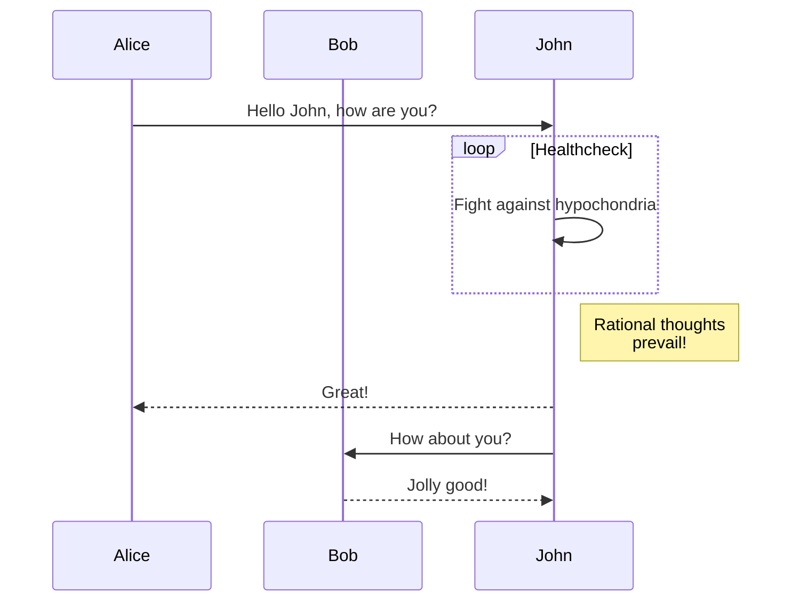
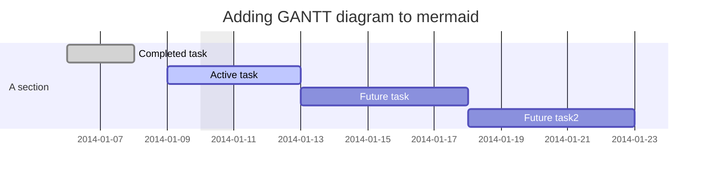

# [hugo 添加　mermaid 支持](https://gohugo.io/content-management/diagrams/#mermaid-diagrams)

# [mermaid　语法](https://mermaid-js.github.io/mermaid/#/)

# 举个栗子

## 流程图

```mermaid
graph TD;
    A-->B;
    A-->C;
    B-->D;
    C-->D;
```

## 序列图

```mermaid
sequenceDiagram
    participant Alice
    participant Bob
    Alice->>John: Hello John, how are you?
    loop Healthcheck
        John->>John: Fight against hypochondria
    end
    Note right of John: Rational thoughts <br/>prevail!
    John-->>Alice: Great!
    John->>Bob: How about you?
    Bob-->>John: Jolly good!
```

## 甘特图

```mermaid
gantt
dateFormat  YYYY-MM-DD
title Adding GANTT diagram to mermaid
excludes weekdays 2014-01-10

section A section
Completed task            :done,    des1, 2014-01-06,2014-01-08
Active task               :active,  des2, 2014-01-09, 3d
Future task               :         des3, after des2, 5d
Future task2               :         des4, after des3, 5d
```